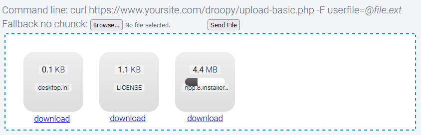

# droopy


droopy is a unique page where you simply drop and upload any file size, thanks to chunking. Based on Dropzone.js and php.

Default chunk size of 1000000b to bypass most enterprise proxies that would prevent more then 1Mb uploads.

## Features

- [x] fallback methods and command line ready with curl
- [x] chunking: because sometimes ou are behind a dumb IDS or firewall that will prevent you from uploading more then 1MB at a time
- [x] simplicity
- [x] works out of the box. No configuration needed
- [x] forbidden characters protection in filenames uploaded
- [x] everything goes to /droopy/uploads

## Installation

Clone the repo, `mkdir droopy/uploads` subfolder and other cutom subfolders if needed, serve it via nginx. Done.

## Word of wisdom

There is no security at all, this is PHP. You need at least basic authentication at the nginx level, or bad things will happen to you.

## nginx proxy sample

nginx proxy example below for [linuxserver/nginx](https://docs.linuxserver.io/images/docker-nginx):
```
server {
  listen 80 dockerNetworkName;
  server_name dockerNetworkName;

  set $root /var/www/html/yoursite.com/public;
  if (!-d /var/www/html/yoursite.com/public) {
      set $root /config/www;
  }
  root $root;
  index index.html index.htm index.php;

  ## uploader
  location /droopy/uploads/ {
    autoindex on;
  }

  location / {
    # enable for basic auth
    #auth_basic "Restricted";
    #auth_basic_user_file /config/nginx/.htpasswd;

    try_files $uri $uri/ /index.html /index.php$is_args$args =404;
  }

  location ~ ^(.+\.php)(.*)$ {
      fastcgi_split_path_info ^(.+\.php)(.*)$;
      fastcgi_pass 127.0.0.1:9000;
      fastcgi_index index.php;
      include /etc/nginx/fastcgi_params;
  }

  # deny access to .htaccess/.htpasswd files
  location ~ /\.ht {
      deny all;
  }
}
```

### TODO
- [ ] mkdir subfolders
- [ ] add some form options to the front such as chunk size, chunk on/off etc
- [ ] loads cutomizations off a json file
- [ ] show newly uploaded files directly under the dropzone
- [ ] ability to delete newly uploaded files, until page refresh
- [ ] create an nginx/php quirk to have dynamic and unique urls to share files
- [ ] ability to setup retention from the front and default retention at the backend
- [x] protect filenames in the _GET
- [x] handle multiple custom subfolders based off a dictionary
- [x] add non-chunk, command line example
- [x] add non-chunk, native and basic 1-file upload form
- [x] handle filename without extension
